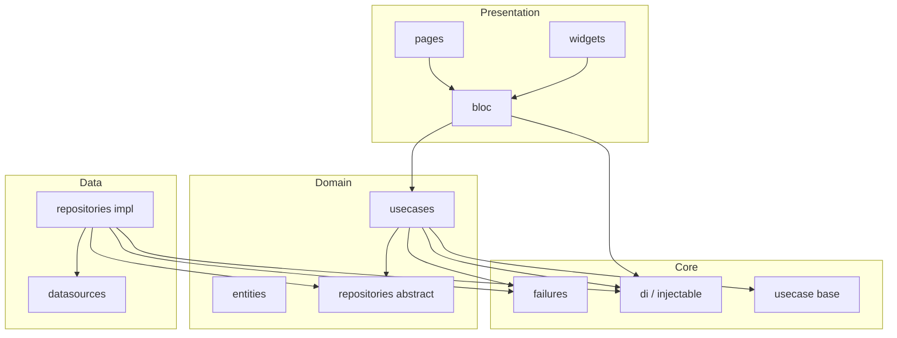

# Clean Architecture — portfolio_version_2

Tài liệu mô tả cách dự án Flutter này áp dụng **Clean Architecture** theo hướng **feature-first**: phụ thuộc luôn hướng **vào trong** (Presentation → Domain ← Data).

---

## 1. Nguyên tắc

| Nguyên tắc | Ý nghĩa trong repo |
|------------|---------------------|
| **Domain ở trung tâm** | Entities, contract repository, use case — không phụ thuộc Flutter UI hay HTTP cụ thể. |
| **Data triển khai contract** | Datasource + `RepositoryImpl` map lỗi → `Failure`, dữ liệu → entity. |
| **Presentation mỏng** | Bloc gọi use case; widget chỉ render theo `state.status`. |
| **Lỗi hai tầng** | `Failure` (domain/data); `ErrorModel` (presentation / hiển thị + JSON khi cần). |

---

## 2. Sơ đồ phụ thuộc



---

## 3. Cây thư mục (thực tế)

```
lib/
├── main.dart
├── core/
│   ├── animations/          # Hiệu ứng dùng chung (flutter_animate)
│   ├── config/              # app_flavor.dart (F.name cho injectable env)
│   ├── di/                  # di_service.dart + *.config.dart (generated)
│   ├── error/               # failures.dart
│   ├── extensions/          # ví dụ context device size
│   ├── models/              # error_model (Freezed + JSON)
│   ├── theme/
│   ├── usecases/            # UseCase<Result, Params>, NoParams
│   └── utils/
└── features/
    └── portfolio/
        ├── domain/
        │   ├── entities/
        │   ├── repositories/    # interface: PortfolioRepository
        │   └── usecases/        # GetPortfolio
        ├── data/
        │   ├── datasources/     # PortfolioLocalDataSource + Impl
        │   └── repositories/    # PortfolioRepositoryImpl
        └── presentation/
            ├── bloc/
            ├── pages/           # PortfolioPage: Provider + Listener + child
            └── widgets/
                ├── shell/       # PortfolioView (Scaffold + BlocBuilder)
                ├── layout/      # PortfolioProfileBody (scroll + kIsWeb)
                ├── shared/      # SectionHeader, footer…
                ├── hero/
                ├── skills/
                ├── projects/
                ├── experience/
                └── contact/
```

---

## 4. Domain layer

- **Entities**: object nghiệp vụ thuần (ví dụ `PortfolioProfile`, `Project`). Có thể dùng `Equatable`. Không import `flutter`, không map JSON tại đây.
- **Repository (interface)**: chỉ khai báo hành vi, kiểu trả về `Future<Either<Failure, T>>` (package **dartz**).
- **Use case**: một hành động nghiệp vụ; implement `UseCase<Result, Params>` trong `core/usecases/usecase.dart`; chỉ gọi repository.
- **Failure**: lỗi nghiệp vụ tại `core/error/failures.dart`; không dùng `ErrorModel` trong domain.

---

## 5. Data layer

- **Datasource**: đọc/ghi dữ liệu (local, remote sau này). Có thể `throw` hoặc trả model — repository chịu trách nhiệm gói vào `Either`.
- **RepositoryImpl**: implement interface domain; `try/catch` → `Left(CacheFailure())` hoặc tương đương; thành công → `Right(entity)`.
- **Cấm** import `presentation/`, `flutter_bloc` từ `data/`.

---

## 6. Presentation layer

### 6.1 Trang (`pages/`)

- **`PortfolioPage`**: `BlocProvider` + `BlocListener` (side effect, ví dụ log lỗi debug) + `child: PortfolioView()`.
- Không đặt logic nghiệp vụ hay gọi repository trực tiếp trong page.

### 6.2 Shell & layout (`widgets/shell`, `widgets/layout`)

- **`PortfolioView`**: `Scaffold` + `BlocBuilder` — phân nhánh theo `PortfolioStatus` (loading / loaded / error).
- **`PortfolioProfileBody`**: một danh sách section (hero, skills, …), shell khác nhau giữa web và native qua `kIsWeb`.

### 6.3 Bloc

- **Events**: `sealed` / `final class` + `Equatable`.
- **State**: một class **Freezed** + enum **status** (`init`, `showLoading`, `loaded`, `error`) + field dữ liệu (`profile`) + `ErrorModel?`.
- Bloc inject **use case**; `Failure` → `ErrorModel(message: …)` khi emit lỗi.

### 6.4 Widget theo section

- Mỗi nhóm UI nằm trong thư mục riêng (`hero/`, `skills/`, …); phần dùng chung ở `shared/`.

---

## 7. Dependency Injection (GetIt + injectable)

- File gốc: `lib/core/di/di_service.dart` — annotation **`@InjectableInit`**, gọi `_getIt.init(environment: …)`.
- **`DiService.setup()`** trong `main` trước `runApp`.
- **Environment**: `kIsWeb ? 'web' : F.name` với `F.name` từ `APP_FLAVOR` (`--dart-define=APP_FLAVOR=staging`).
- Đăng ký class:
  - `@LazySingleton(as: Interface)` cho datasource / repository impl.
  - `@lazySingleton` cho use case.
  - `@injectable` cho **Bloc** (factory — instance mới khi cần).

Sau khi thêm/sửa annotation:

```bash
dart run build_runner build --delete-conflicting-outputs
```

---

## 8. Code generation

| Công cụ | Output (thường gitignored) |
|---------|------------------------------|
| **freezed** + **json_serializable** | `*.freezed.dart`, `*.g.dart` |
| **injectable_generator** | `di_service.config.dart` |

Clone mới hoặc CI cần chạy lại `build_runner` nếu repo không commit file generated.

---

## 9. Luồng ví dụ: tải portfolio

1. `PortfolioPage` tạo `PortfolioBloc` và `LoadPortfolio`.
2. Bloc gọi `GetPortfolio(NoParams())`.
3. Use case gọi `PortfolioRepository.getProfile()`.
4. `PortfolioRepositoryImpl` gọi `PortfolioLocalDataSource.getProfile()` (hiện tại là dữ liệu cục bộ).
5. Kết quả `Either` được fold trong Bloc → cập nhật `PortfolioState` (loaded / error).
6. `PortfolioView` render `PortfolioProfileBody` hoặc loading / error UI.

---

## 10. Anti-patterns (tránh)

- Gọi API / repository / `Either` trực tiếp trong widget (ngoài Bloc).
- Entity phụ thuộc DTO JSON hoặc `BuildContext`.
- Trùng hai luồng scroll web/mobile với cùng nội dung — nên một `layout` adaptive.
- Nhầm `Failure` với `ErrorModel` khi thiết kế domain.

---

## 11. Checklist thêm feature mới

1. `domain/entities`, `domain/repositories` (interface), `domain/usecases`.
2. `data/datasources`, `data/repositories` (impl).
3. Gắn `@LazySingleton` / `@lazySingleton` / `@injectable` và chạy `build_runner`.
4. `presentation/bloc` (event, state Freezed, bloc).
5. `pages` + `widgets` (shell/layout/section).
6. `flutter analyze` + test liên quan.

---

## 12. Tham chiếu nhanh file quan trọng

| Vai trò | File |
|---------|------|
| DI entry | `lib/core/di/di_service.dart` |
| Base use case | `lib/core/usecases/usecase.dart` |
| Failure | `lib/core/error/failures.dart` |
| Error UI/state model | `lib/core/models/error_model.dart` |
| Feature portfolio domain | `lib/features/portfolio/domain/` |
| Feature portfolio data | `lib/features/portfolio/data/` |
| Feature portfolio UI | `lib/features/portfolio/presentation/` |

---

*Tài liệu này phản ánh cấu trúc tại thời điểm viết; khi refactor, nên cập nhật mục 3 và 12 cho khớp repo.*
